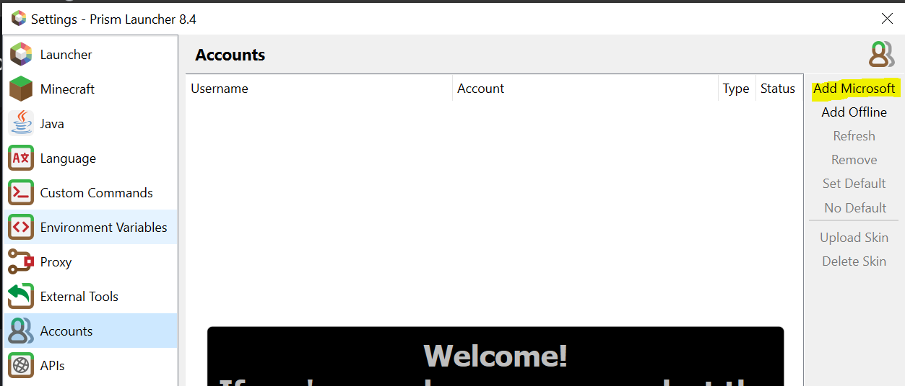
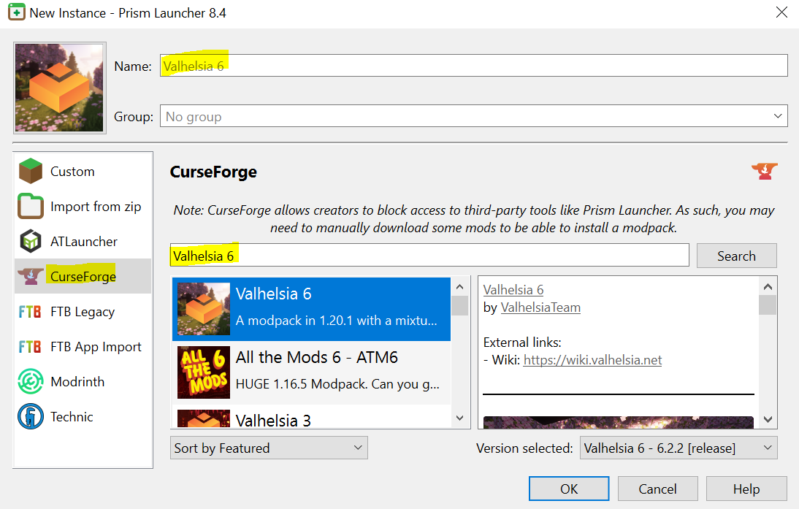
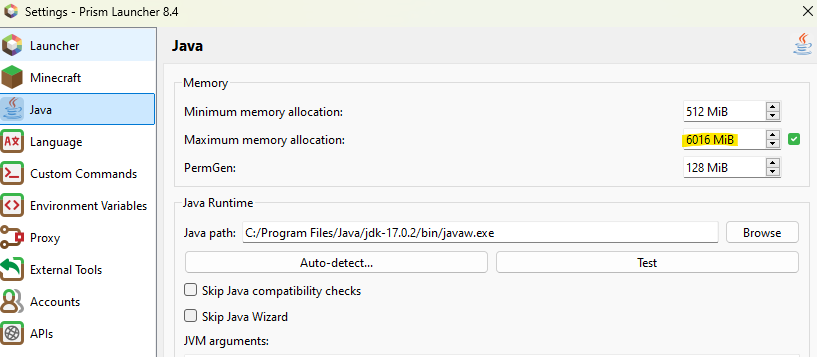

# BLA Minecraft Server

The deployment, installation and administration of the BLA Minecraft Server.
This is being deployed using Hashicorp Terraform and hosted on Amazon Web Services (AWS)


## Install Valhelsia 6
Instructions for installing Valhesia can be found below.
1. Download Java 17 - [Java 17 Download](https://aka.ms/download-jdk/microsoft-jdk-17.0.12-windows-x64.msi)
2. Download Prism Launcher - [Prism Launcher Download](https://github.com/PrismLauncher/PrismLauncher/releases/download/8.4/PrismLauncher-Windows-MSVC-Setup-8.4.exe)
3. Open the Prism Launcher. At the top right link your Microsoft account associated with your Minecraft Account
    
     - This will prompt you to log into your Microsoft Account;
     - Allow Prism access to your account when prompted.
     - Once complete, navigate back to the Prism launcher
4. Add an instance via the top left of the launcher. 
     - This will open a screen with a list on the left of different file hosts
     - Select CurseForge, search and download *Valhelsia 6*
     
5. Once it’s downloaded; navigate to Settings > Java
     - Increase the max allocated RAM to a minimum requirement of 6GB (6144 MB) or 8GB depending on your devices RAM capacity.
     
     - Once set; close the settings window.
6. Launch Valhelsia 6 from either the 'Launch' button or by double clicking on it.
     - This will initiate the install and launch process in order for you to play the game.
     - Follow this step each time you'd like to launch the modpack.

## Configure Server Access

1. Download AWS-CLI-V2 - [AWS CLI V2 Download](https://awscli.amazonaws.com/AWSCLIV2.msi)

```powershell
  npm install my-project
  cd my-project
```
    
## Usage/Examples

```javascript
import Component from 'my-project'

function App() {
  return <Component />
}
```


