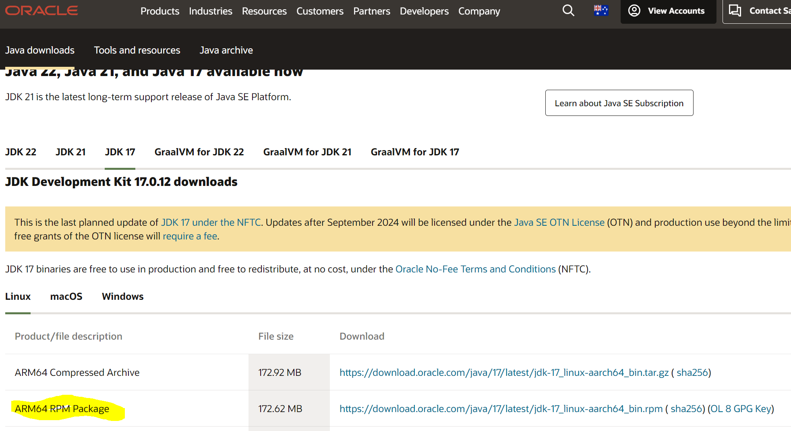

# BLA Minecraft Server

The deployment, installation and administration of the BLA Minecraft Server.
This is being deployed using Hashicorp Terraform and hosted on Amazon Web Services (AWS)


## Install Valhelsia 6
Instructions for installing Valhesia can be found below.
1. Download Java 17 - [Java 17 Download](https://www.oracle.com/au/java/technologies/downloads/#java17)
    
2. Download Prism Launcher - [Prism Launcher Download](https://linktodocumentation)
3. Open the Prism Launcher. At the top right link your Microsoft account associated with your Minecraft Account
     - Once completed; navigate back to the Prism launcher
4. Add an instance via the top left of the launcher. 
     - This will open a screen with a list on the left of different file hosts
     - Select CurseForge, search and download *Valhelsia 6*
5. Once it’s downloaded right click it and edit settings
     - Increase the max allocated ram to at least 6gb (6144 MB) or 8gb depending on how much ram your pc has
     - Save/apply that
6. Then launch valhelsia either from the right launch button or double click it
     - It’ll then install whatever and eventually boot up MC forge that’ll load all the mods

## Configure Server Access

1. Download AWS-CLI-V2 - [AWS CLI V2 Download](https://awscli.amazonaws.com/AWSCLIV2.msi)

```powershell
  npm install my-project
  cd my-project
```
    
## Usage/Examples

```javascript
import Component from 'my-project'

function App() {
  return <Component />
}
```


